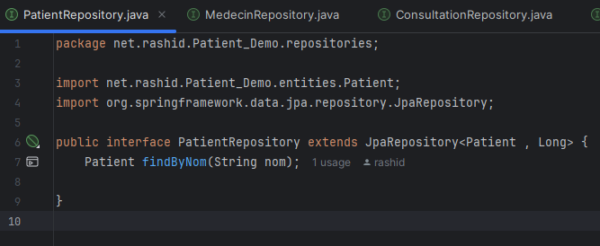
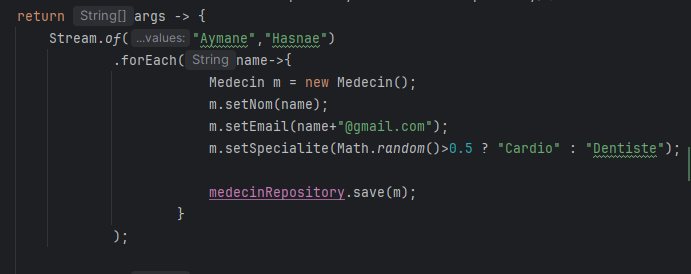

# Oumoulay Rashid
# TP_Patient_Demo
# Sys_D

<h2>Objectif : </h2>
1. Installer IntelliJ Ultimate
2. Créer un projet Spring Initializer avec les dépendances JPA, H2, Spring Web et Lombock
3. Créer l'entité JPA Patient ayant les attributs :
       - id de type Long
       - nom de type String
       - dateNaissanec de type Date
       - malade de type boolean
       - score de type int

4. Configurer l'unité de persistance dans le ficher application.properties 

5. Créer l'interface JPA Repository basée sur Spring data

6. Tester quelques opérations de gestion de patients :
    - Ajouter des patients
    
    - Consulter tous les patients
    - Consulter un patient
    - Chercher des patients
    
    - Mettre à jour un patient 
    - supprimer un patient
8. Reprendre les exemples  du Patient, Médecin, rendez-vous, consultation

<h2>Résultats : </h2>

